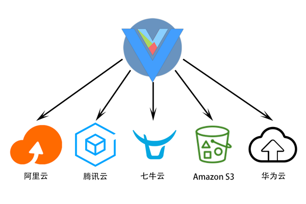
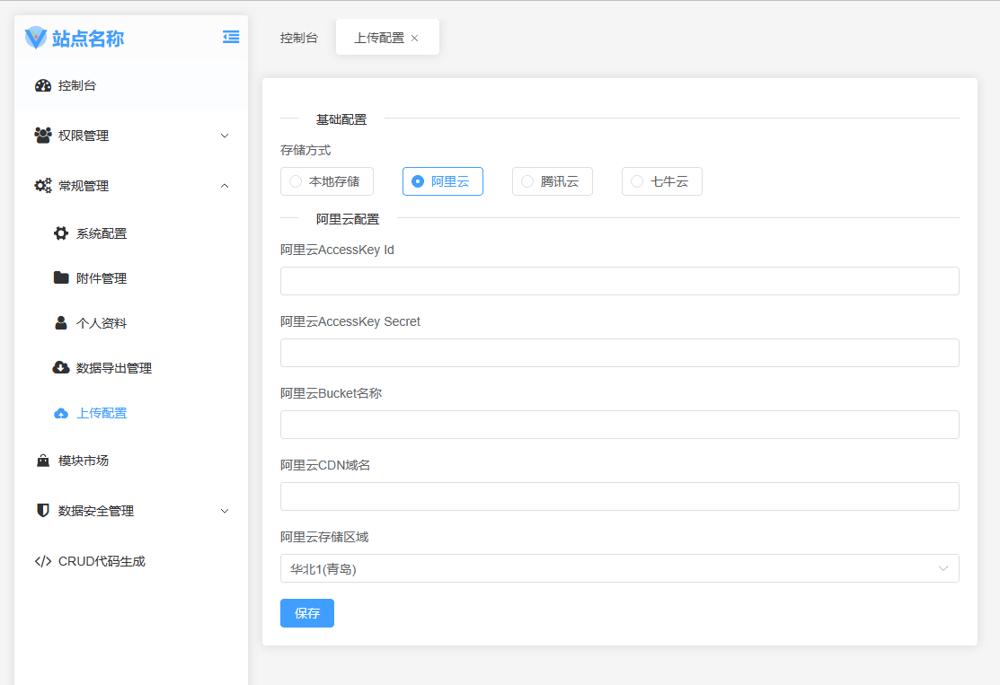

<center>



</center>

### 简介

本扩展为[BuildAdmin](https://wonderful-code.gitee.io/)专用扩展，为系统提供文件直传到到多个云存储的功能，支持阿里云、腾讯云、七牛云、华为云(开发中)、亚马逊S3(规划中)。

### 功能特性/实现
- 客户端直传
- 在附件管理中删除文件时可自动删除云存储空间的文件
- 覆盖系统WEB端的上传扩展文件
- 服务端使用了各平台官方提供的SDK，模块安装时需执行`composer update`，这个步骤通常是自动的

### 安装

1. 在`BuildAdmin`模块市场搜索本插件;
2. 将本仓库下载为`zip`文件，然后在`后台->模块市场->上传安装`

### 独立设置界面

<center>



</center>

### 各平台配置步骤

#### 阿里云

1. 注册阿里云账户，[注册地址](https://account.aliyun.com/register/qr_register.html)
2. 在阿里云对象存储功能内创建好Bucket
3. 进入Bucket详情页面，点击`权限控制->读写权限`，开发阶段建议将`Bucket ACL`设置为`公共读`
4. 进入Bucket详情页面，点击`数据安全->跨域设置`，开发阶段建议将`来源`、`允许Methods`和`允许Headers`全部设定为`*`
5. 在[AccessKey管理](https://ram.console.aliyun.com/manage/ak)页面获取`AccessKey`和`SecretKey`
6. 在[Bucket列表](https://oss.console.aliyun.com/bucket)页面获取`Bucket名称`和`Bucket地域`
7. 打开`后台->常规管理->上传配置`，选择`阿里云`，并将准备好的信息填入，最后清理缓存即可使用

#### 腾讯云

1. 注册腾讯云账户，[注册地址](https://cloud.tencent.com/)
2. 在腾讯云对象存储功能内创建好存储桶，访问权限需为**公有读私有写**
3. 进入存储桶详情页面，点击`安全管理->跨域访问CORS设置`，开发阶段建议将`来源Origin`、`操作Methods`和`Allow Headers`全部设定为`*`
4. 在[密钥管理](https://console.cloud.tencent.com/cam/capi)页面获取`SecretId`、`SecretKey`
5. 在[存储桶列表](https://console.cloud.tencent.com/cos/bucket)页面获取存`储桶名称（bucket）`、`存储桶所属地域（region）`
6. 打开`后台->常规管理->上传配置`，选择`腾讯云`，并将准备好的信息填入，最后清理缓存即可使用

#### 七牛云

1. 注册七牛云存储账户，[注册地址](https://portal.qiniu.com/kodo/overview)
2. 自行建立存储空间，请将访问控制设置为**公开**
3. 创建空间后请为空间配置跨域设置，开发阶段建议将来源，`允许Methods`，`允许 Headers`全部设定为`*`
4. 进入[密钥管理](https://portal.qiniu.com/user/key)查看账户的`AccessKey`和`SecretKey`
5. 打开`后台->常规管理->上传配置`，选择`七牛云`，并将准备好的信息填入，最后清理缓存即可使用

### 华为云

```php
// TODO.
```

### 亚马逊S3

```php
// TODO.
```


### 注意

使用本插件后，本地资源文件将无法访问，建议使用前提前将本地资源文件上传至对应的COS存储中，正常情况下是站点`public`目录里边的`static`和`storage`目录。
